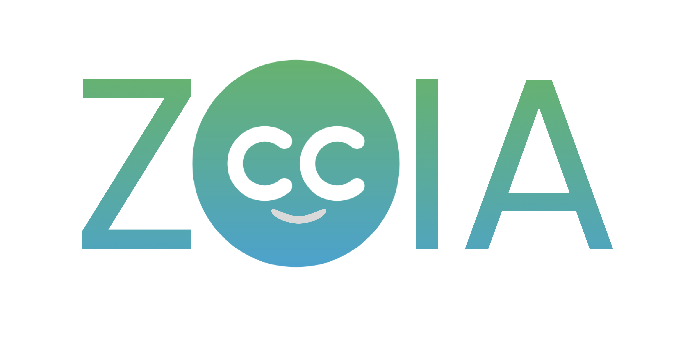

# ZoIA - AI-powered Image Captioner Extension

## About ZoIA

ZoIA is a browser extension (currently working on Google Chrome) that is capable to inject alternative texts into the image DOM Elements. That is possible by powering the ZoIA API with a CNN-LSTM Transformer Deep Learn model.

## About the CNN-LSTM Transformer Deep Learn model

Currently, the API is powered with the pre-trained [vit-gpt2-image-captioning](https://huggingface.co/nlpconnect/vit-gpt2-image-captioning) model, trained by [@ydshieh](https://ankur3107.github.io/blogs/the-illustrated-image-captioning-using-transformers/), available on [HuggingFace](https://huggingface.co).

> The future objective is to try to build and train a transformer using a photo caption dataset with Portuguese descriptions. The first choice was to integrate a pre-trained model because the current computer resources to develop and research a model from scratch are insufficient.

## About the extension

Currently, the extension just works on Google Chrome/Chromium browsers, but the plans are to expand its use to other platforms.

The extension has a popup, that the user can configure, enable or disable and also login into their account to use the API. 

To use the API to inject alternative texts on the browser DOM, the user can press Alt + Shift + Z when an image is in focus.

## About the API

The ZoIA API is built with Python3.10 and Flask and was thought to be simple. 

The backend manages the user registers and their logins, which is necessary just to control the API use, and also manage the caption generation. 

To generate the captions, ZoIA is powered by the [@ydshieh](https://ankur3107.github.io/blogs/the-illustrated-image-captioning-using-transformers/) Image Captioning pre-trained model, as commented before, that is integrated with the API using the PyTorch framework and the sample code from the HugginFace repository: [vit-gpt2-image-captioning](https://huggingface.co/nlpconnect/vit-gpt2-image-captioning). 

## About the work-flow

To use ZoIA you need to follow the steps below:

1. Register on the API as a user, using the webpage.
2. Download the extension on your browser (not available yet on the Chrome Extensions store).
3. Connect your account to the extension, using the popup, and make sure that the software is enabled to run.
4. Use the Alt + Shift + Z shortcut to generate a caption for an image that is on focus on your screen.

## Credits and acknowledgments

- [@ydshieh](https://ankur3107.github.io/blogs/the-illustrated-image-captioning-using-transformers/) for the [vit-gpt2-image-captioning](https://huggingface.co/nlpconnect/vit-gpt2-image-captioning) model
- Icons and images from [Flaticon](https://www.flaticon.com/br/)
  - [CC icon](https://www.flaticon.com/free-icon/cc_9740948?term=closed+caption&page=1&position=4&origin=search&related_id=9740948), from Graphics Plazza
  - [Eyes icons](https://www.flaticon.com/packs/eyes-pack?word=eyes), from Freepik
